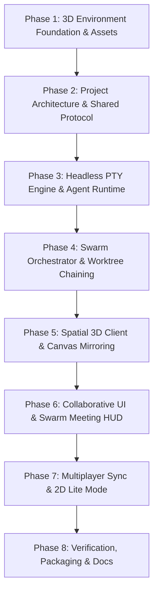
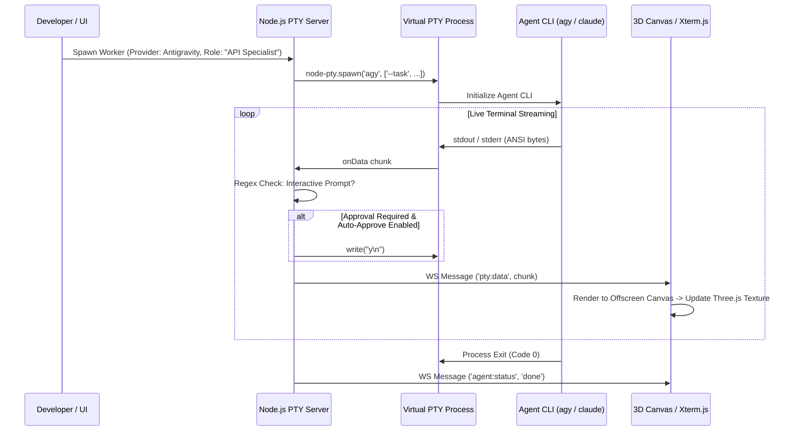
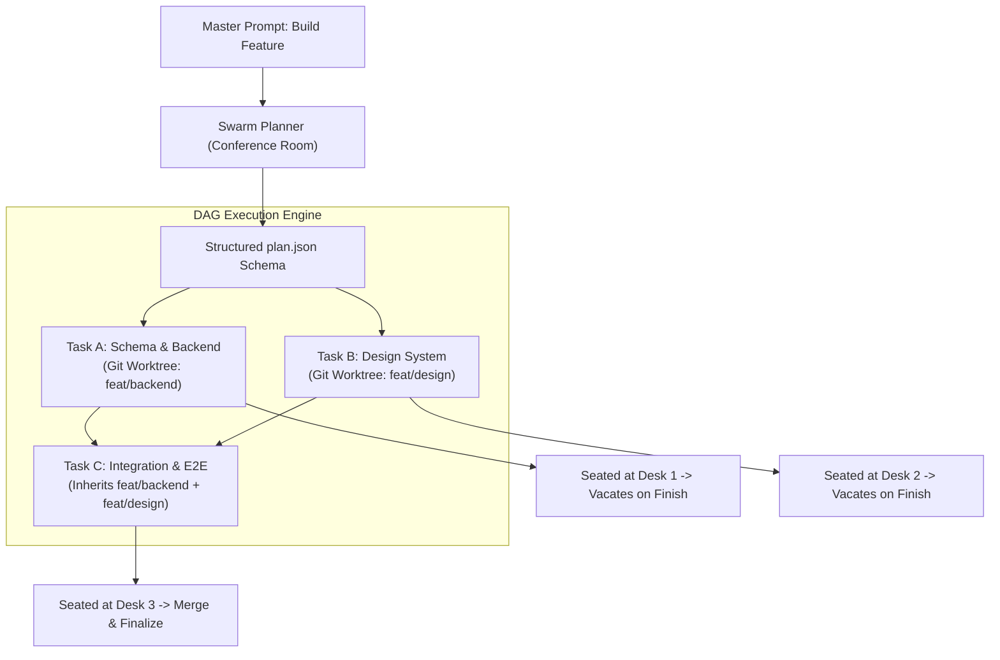

# Agentic Hub Office — Master Engineering Plan

**Spatial 3D Multi-Agent Workspace & Autonomous Swarm Orchestration Engine**  
*Collaborative Hackathon Engineering Blueprint & Phased Roadmap*

---

## 1. Executive Summary & Project Vision

**Agentic Hub Office** transforms autonomous AI software engineering into an intuitive, physical, spatial experience. Managing multiple autonomous coding agents in traditional terminal tabs often leads to cognitive overload, silent hangs, merge conflicts, and lost execution context. Agentic Hub solves this by placing an entire AI engineering team inside an interactive 3D virtual office.

Engineers walk up to a conference table, submit a high-level **Master Prompt**, and watch a **Swarm Planner Agent** construct a topological task graph (`plan.json`). Specialized worker agents (*Frontend Specialist*, *Database Architect*, *QA Engineer*) are then automatically dispatched to physical desks in the office. Each worker runs a sandboxed CLI agent inside an isolated Git worktree, while their live terminal output streams onto the 3D laptop screen on their desk in real-time.

```
+-------------------------------------------------------------------------------+
|                             AGENTIC HUB ARCHITECTURE                          |
+-------------------------------------------------------------------------------+
                                        |
                 [ Developer Submits Master Prompt at Meeting Table ]
                                        |
                                        v
                 +---------------------------------------------+
                 |          Swarm Planner Agent (Room)         |
                 |     Analyzes Repo -> Generates plan.json     |
                 +---------------------------------------------+
                                        |
                 +---------------------------------------------+
                 |         Topological Scheduler & DAG         |
                 |       Resolves Prerequisite Worktrees       |
                 +---------------------------------------------+
                                        |
                 +----------------------+----------------------+
                 |                                             |
                 v                                             v
  +-----------------------------+               +-----------------------------+
  |    Task 1: API Specialist   |               |    Task 2: UI Specialist    |
  |  - Seated at Desk A         |               |  - Seated at Desk B         |
  |  - Node-PTY Process Spawned |               |  - Node-PTY Process Spawned |
  |  - Worktree: task/api-core  |               |  - Worktree: task/ui-core   |
  |  - Auto-Approval Pattern Mat|               |  - Auto-Approval Pattern Mat|
  |  - 3D Laptop Canvas Mirror  |               |  - 3D Laptop Canvas Mirror  |
  +-----------------------------+               +-----------------------------+
                 |                                             |
                 +----------------------+----------------------+
                                        | (Both Tasks Complete -> Desks Vacate)
                                        v
                 +---------------------------------------------+
                 |       Task 3: Integration & QA Engineer     |
                 |  - Inherits Merged Worktree Context         |
                 |  - Seated at Desk C -> Runs Verification    |
                 +---------------------------------------------+
```

---

## 2. Hackathon Team Division (2 Developers)

To ensure rapid, clean, and authentic progress during the hackathon, our 2-person team divides responsibilities across two clear architectural boundaries:

| Team Member | Core Focus | Key Deliverables |
|---|---|---|
| **Developer 1 (Core Systems & Orchestration)** | Backend runtime, process management, AI provider integrations, and git worktrees. | - Node-PTY virtual terminal manager (`src/server/ptys.ts`)<br>- Multi-provider agent runtime (`agy`, Claude Code, Codex, Grok)<br>- Regex pattern-matching auto-approver (`src/server/prompts.ts`)<br>- Swarm planner & DAG execution scheduler (`src/server/swarm-plan.ts`)<br>- Git worktree branch isolation and chaining (`src/server/worktrees.ts`)<br>- WebSocket server protocol and state relay (`src/server/server.ts`) |
| **Developer 2 (Spatial Experience & Frontend)** | Three.js 3D world, WebGL rendering, UI HUD, and interactive terminal mirrors. | - Three.js scene assembly and toon shading (`src/client/world/office.ts`)<br>- Blender asset generation pipeline and GLTF loader (`blender/`, `src/client/world/models.ts`)<br>- Procedural agent avatars, seating, and animation states (`src/client/world/character.ts`)<br>- Dynamic 2D canvas texture generation for 3D laptop screens (`src/client/world/laptop.ts`)<br>- Xterm.js terminal modal and interactive keyboard capture (`src/client/ui/terminal.ts`)<br>- Swarm conference table HUD & responsive 2D lite dashboard (`/lite`) |

---

## 3. Scope Pruning: Eliminating Distractions

The original prototype contained toy minigames and experimental distractions that bloated the codebase and distracted from the core mission of autonomous software engineering. 

### Explicitly Pruned Components:
- **Basketball Court & Ball Physics (`court.ts`, `hoop.ts`, `throwing.ts`):** Removed. Replaced by a clean office wall and presentation board.
- **Cars & Vehicle Physics (`cars.ts`, `driving.ts`, `garage.ts`):** Removed. Underground garage repurposed for clean structural aesthetics without vehicle simulation.
- **Golf Minigame (`golf.ts`):** Removed. Balcony converted into an architectural outdoor terrace.
- **Arcade & Bar Minigames (`bargames.ts`, `drunk.ts`, `booze.ts`, `castle.ts`):** Removed. Retained only the modern collaborative office environment.

By stripping these non-essential items, the codebase remains 100% focused on **enterprise agentic workflow, real-time terminal virtualization, and swarm coordination**.

---

## 4. Phased Implementation Roadmap



### Phase 1: 3D Environment Foundation & Asset Pipeline (Current Phase)
- **Objective:** Import and validate the pure 3D assets so all 3D environment dependencies are established, leaving only backend and orchestration coding.
- **Actions:**
  - Import compiled `.glb` binary assets: `office_shell.glb`, `desk_props.glb`, `kitchen.glb`, `lounge.glb`, `plants.glb`, `dog-*.glb`.
  - Import headless Blender Python generation kit (`blender/scripts/aokit.py`, `build_office_shell.py`, etc.).
  - Set up Three.js GLTF asset loader with custom toon shading and palette system (`models.ts`, `toon.ts`, `styles.ts`).
  - Implement 3D model validation unit tests (`tests/glb.ts`, `tests/*-model.test.ts`) to verify vertices, node bounds, and material names.
  - Prune all basketball, vehicle, and golf references from `src/client/world/office.ts`.

### Phase 2: Project Architecture & Shared Protocol Schemas
- **Objective:** Build the monorepo skeleton, TypeScript configurations, and shared network contracts.
- **Actions:**
  - Configure root `package.json`, `tsconfig.base.json`, `tsconfig.client.json`, `tsconfig.server.json`, and `vite.config.ts`.
  - Establish `src/shared/protocol.ts`: Type-safe WebSocket message contracts (`pty:data`, `pty:resize`, `agent:spawn`, `agent:status`, `swarm:plan`, `presence:move`).
  - Establish `src/shared/layout.ts`: Spatial coordinates for desks, conference seating, elevator, stations, and collision boundaries.
  - Establish `src/shared/status.ts`: Formal state machine for agents (`spawning`, `idle`, `thinking`, `working`, `waiting_for_input`, `done`, `failed`).

### Phase 3: Headless PTY Engine & Multi-Provider Agent Runtime
- **Objective:** Enable real-time virtual pseudo-terminal (PTY) spawning with pattern-matching auto-approval.
- **Actions:**
  - Build `src/server/ptyhost.ts` and `src/server/ptys.ts` using `@lydell/node-pty`.
  - Implement ANSI terminal ring buffers to capture and replay execution scrollback on client reconnect.
  - Implement `src/server/prompts.ts`: Real-time regex pattern matcher to detect CLI approval prompts (e.g., `[y/N]`, `Allow action?`, `Confirm (y/n)`) and send automated newline responses when enabled.
  - Build CLI process adapters for Google Antigravity (`agy`), Anthropic Claude Code, OpenAI Codex, and OpenCode.



### Phase 4: Swarm Orchestration Engine & Git Worktree Chaining
- **Objective:** Autonomous multi-agent coordination with branch isolation and topological handoffs.
- **Actions:**
  - Build `src/server/swarm-plan.ts` and `src/server/meetings.ts`: Conference table coordinator where the Planner Agent outputs structured `plan.json`.
  - Validate JSON schema: ensure every task has a role name, prompt, acceptance criteria, and prerequisite task IDs.
  - Build `src/server/worktrees.ts`: Automatically provision clean Git worktrees (`.agent-office/worktrees/<task-id>`) from base branch.
  - Implement Topological DAG Chaining: Dependent tasks automatically branch off the completed worktree of their prerequisites, preventing merge conflicts.
  - Automatic Desk Turnover: When an agent finishes, send `kill('keep')`, merge the worktree, and vacate the desk immediately to free physical office capacity.



### Phase 5: Spatial 3D Client & Live Terminal Canvas Mirroring
- **Objective:** Render the 3D office in Three.js and project live terminal streams onto desk laptop displays.
- **Actions:**
  - Assemble office scene graph (`src/client/world/office.ts`) with custom toon shaders, shadows, and lighting.
  - Implement first-person player controls (WASD, mouse pointer lock, collision detection, proximity raycasting).
  - Build procedural worker avatars (`src/client/world/character.ts`) with sitting, typing, thinking bob, and celebration dances.
  - Build 3D laptop displays (`src/client/world/laptop.ts`): Feed PTY data into an offscreen HTML canvas, drawing ANSI characters onto a high-performance Three.js `CanvasTexture`.

### Phase 6: Swarm Conference Room & Interactive Takeover UI
- **Objective:** Provide high-fidelity HUD modals for swarm meetings and direct terminal intervention.
- **Actions:**
  - Build Meeting Room UI (`src/client/ui/meeting.ts`): Walk up to the conference table, press <kbd>E</kbd>, select AI provider, and submit Master Prompt.
  - Implement Swarm Board (`src/client/ui/boards.ts`): Live visual projection of `plan.json` task statuses onto the conference room whiteboard.
  - Implement Fullscreen Takeover Terminal (`src/client/ui/terminal.ts`): Press <kbd>E</kbd> at any desk to open an Xterm.js modal and directly interact with the running agent.
  - Add spatial audio cues and notifications for worker inputs, questions, and task completions.

### Phase 7: Real-Time Multiplayer Sync & Lightweight 2D Mode
- **Objective:** Multi-user collaboration and low-power mobile access.
- **Actions:**
  - Implement WebSocket relay (`src/server/relay.ts`) for real-time multiplayer presence (player position, orientation, active room).
  - Integrate collaborative whiteboard canvas (`src/client/ui/whiteboard.ts`) powered by Excalidraw.
  - Build ultra-fast 2D mobile view (`src/client/lite.html`, `src/client/lite.ts`) displaying live agent status cards, terminal streams, and swarm progress without WebGL overhead.

### Phase 8: Verification, Packaging & Production Launch
- **Objective:** Final testing, packaging, and hackathon presentation delivery.
- **Actions:**
  - Run end-to-end integration tests (`npm test` via Node test runner).
  - Package standalone CLI launcher binaries (`bin/agent-office.js`, `bin/agentic-hub`).
  - Create Windows quickstart scripts (`AgenticHub-Launcher.bat`, `install-windows.ps1`).
  - Verify complete workflow with live multi-agent swarm demonstrations.

---

## 5. Directory Structure Skeleton

```
Agentic-Hub-office/
├── PLAN.md                         # This Master Engineering Plan
├── package.json                    # Project manifest & unified script runner
├── tsconfig.base.json              # Shared TypeScript compiler options
├── tsconfig.client.json            # Client-specific DOM/Bundler TS configuration
├── tsconfig.server.json            # Server-specific NodeNext TS configuration
├── vite.config.ts                  # Vite client build & development proxy configuration
├── .gitignore                      # Git ignore patterns
│
├── blender/                        # 3D Asset Source & Headless Generation Kit
│   ├── README.md                   # Blender Python tooling & convention guide
│   └── scripts/
│       ├── aokit.py                # Core procedural geometry, armature & export kit
│       ├── build_office_shell.py   # Office walls, floor, and ceiling generator
│       ├── build_desk_props.py     # Desks, monitors, keyboards & clutter generator
│       ├── build_kitchen.py        # Office kitchen & coffee counter generator
│       ├── build_lounge.py         # Lounge couches, coffee tables & lamps generator
│       ├── build_plants.py         # Monstera, ficus & desk succulent generator
│       ├── build_dog.py            # Rigged office dog mesh & animation generator
│       └── dog_breeds.py           # Canine breed dimensional presets
│
├── src/
│   ├── client/                     # Frontend 3D Engine, HUD & UI
│   │   ├── index.html              # Main 3D WebGL entry point
│   │   ├── lite.html               # Lightweight 2D dashboard for mobile / remote
│   │   ├── main.ts                 # Client bootstrap & main render loop
│   │   ├── models/                 # Compiled binary GLTF assets (.glb)
│   │   ├── public/                 # Static assets, icons, and SVG graphics
│   │   ├── ui/                     # DOM HUD modals, Xterm.js & Excalidraw whiteboard
│   │   │   ├── meeting.ts          # Swarm conference room configuration modal
│   │   │   ├── terminal.ts         # Fullscreen Xterm.js manual takeover modal
│   │   │   ├── boards.ts           # 3D whiteboard and task status projection
│   │   │   └── hud.ts              # Player HUD, action prompts, and notifications
│   │   └── world/                  # Three.js 3D world components (Cleaned)
│   │       ├── models.ts           # GLTF loader with toon material palette mapper
│   │       ├── office.ts           # Main office 3D scene assembly (Hoop/cars pruned)
│   │       ├── character.ts        # Procedural avatar meshes, rigging & animations
│   │       ├── laptop.ts           # 3D laptop mesh with offscreen canvas texture
│   │       ├── meeting.ts          # Conference table & swarm podium 3D geometry
│   │       ├── whiteboard.ts       # 3D rolling whiteboard geometry
│   │       ├── elevator.ts         # 3D elevator cabin & animated sliding doors
│   │       ├── desksigns.ts        # 3D floating role badges above desks
│   │       ├── toon.ts             # Custom toon outline shader materials
│   │       ├── sky.ts              # Procedural sky dome, sun trajectory & clouds
│   │       ├── city.ts             # 3D exterior city skyline
│   │       └── world.ts            # World scene root interface
│   │
│   ├── server/                     # Node.js Server & Swarm Orchestration Engine
│   │   ├── server.ts               # HTTP & WebSocket server entry point
│   │   ├── cli.ts                  # Command line argument parser & runner
│   │   ├── ptys.ts                 # Virtual PTY process lifecycle manager
│   │   ├── ptyhost.ts              # Native node-pty wrapper & stream buffer
│   │   ├── prompts.ts              # Regex pattern-matching auto-approver
│   │   ├── agents.ts               # Multi-provider agent runtime definitions
│   │   ├── swarm-plan.ts           # plan.json schema validator & topological scheduler
│   │   ├── meetings.ts             # Conference room swarm meeting coordinator
│   │   ├── worktrees.ts            # Git worktree isolation & branch chaining
│   │   └── relay.ts                # WebSocket client sync & multiplayer state relay
│   │
│   └── shared/                     # Shared Protocols, Layouts & Constants
│       ├── protocol.ts             # WebSocket message contracts & payload types
│       ├── layout.ts               # Spatial layout coordinates for desks & furniture
│       ├── status.ts               # Formal agent lifecycle state definitions
│       ├── theme.ts                # Color palette & visual styling tokens
│       ├── decor.ts                # Wall and fixture positioning metadata
│       └── nav.ts                  # Spatial 2D navigation grid & pathfinding
│
└── tests/                          # Automated Verification & Test Suites
    ├── glb.ts                      # Binary glTF parser for automated model verification
    ├── office-shell-model.test.ts  # Office shell dimensional bounds & material test
    ├── desk-props-model.test.ts    # Desk props geometry & anchor points test
    ├── kitchen-model.test.ts       # Kitchen props test
    ├── lounge-model.test.ts        # Lounge props test
    └── plants-model.test.ts        # Office greenery dimensions & material test
```

---

## 6. Phased Progress & Developer 2 Phase 2 Plan

### Phase 1: Completed ✅
- **Delivered by:** Developer 2
- **Artifacts:**
  - Full procedural Blender scripts (`blender/scripts/`) and compiled binary `.glb` assets (`src/client/models/`).
  - Three.js GLTF asset loader with custom toon shading and palette systems (`models.ts`, `toon.ts`, `styles.ts`).
  - Model verification test suites (`tests/glb.ts`, `tests/*-model.test.ts`) passing 57/57 tests.
  - Initial pruning of basketball, vehicles, and golf minigames from 3D world geometry.

---

### Phase 2 (Developer 2): Spatial Client Bootstrap, Pruned Architecture, Core UI & Terminal Mirroring Foundation 🚧 (Current Phase)

Developer 2 now establishes the complete frontend client infrastructure, interactive Xterm.js terminal integration, cleaned first-person navigation, and multi-agent swarm UI modals:

#### Deliverables & Implementation Tasks:
1. **Interactive Terminal Takeover Modal & Keybindings (`src/client/ui/terminal.ts`, `src/client/ui/termkeys.ts`)**:
   - Integrate Xterm.js v6 with `@xterm/addon-fit` and `@xterm/addon-web-links`.
   - Real-time ANSI streaming buffer with scrollback history.
   - Natural Text Editing keybindings (`Shift+Enter` for multiline prompts, `Ctrl+Backspace`, `⌘` shortcuts).
   - Auto-approve toggle (`⚡ Auto-Approve: ON/OFF`) and live viewer counter.
2. **First-Person / Third-Person Player Controller (`src/client/player.ts`)**:
   - WASD movement, pointer lock mouse look, ground height detection, gravity, and stair climbing.
   - Robust collider collision detection and sliding response against office walls, desks, and elevator.
   - Complete pruning of toy minigame physics (no basketball dribbling, no driving physics, no drunk sway).
3. **Multi-Agent Swarm Conference HUD (`src/client/ui/meeting.ts`)**:
   - Swarm Master Prompt input modal.
   - Multi-provider AI selector (Google Antigravity `agy`, Claude Code, OpenAI Codex, OpenCode).
   - Real-time topological task graph visualization (`plan.json`) and token expenditure tracker.
4. **Client HTML & CSS Design System (`src/client/index.html`, `style.css`, `login.html`, `portal.html`, `lite.html`)**:
   - Clean, modern enterprise styling for the 3D HUD, modal overlays, terminal window, and toast notifications.
   - Dedicated 2D Lite Mode (`lite.html`, `lite.ts`, `lite.css`) for mobile and lightweight browser monitoring.
   - Authentication & portal pages (`login.html`, `login.ts`, `portal.html`).
5. **Main 3D Bootstrap & Render Loop (`src/client/main.ts`)**:
   - Three.js scene assembly, camera controls, toon outline post-processing, and dynamic 3D laptop screen canvas updates.
   - Cleaned of all minigame code (basketball court, golf greens, bars, and cars).
6. **Automated Verification (`tests/termkeys.test.ts`, `tests/player.test.ts`, `tests/palette.test.ts`, `tests/termtheme.test.ts`)**:
   - Comprehensive unit tests verifying keyboard translations, terminal themes, palette generation, and collision handling alongside 3D model tests (91 client tests passing).

---

### Phase 2 (Developer 1): Core Systems, Headless PTY Engine, Multi-Provider Agent Runtime & Swarm Orchestration Engine 🚀 (Delivered & Verified)

Developer 1 establishes the entire backend core orchestration engine, multi-provider AI CLI execution layer, Git worktree isolation chaining, regex auto-approval prompt gates, and swarm task DAG coordinator:

#### Deliverables & Implementation Tasks:
1. **Headless PTY Engine & Process Virtualization (`src/server/ptys.ts`, `src/server/ptyhost.ts`)**:
   - Resilient pseudo-terminal management via `@lydell/node-pty`.
   - Native ANSI stream ring buffers for instant reconnection scrollback and state restoration.
   - Clean child process exit detection, error capturing, and lifecycle management.
2. **Real-Time Regex Auto-Approval Pattern Matcher (`src/server/prompts.ts`, `src/shared/prompts.ts`)**:
   - Detection of CLI interactive confirmations across agent providers (`[y/N]`, `Allow action?`, `Confirm (y/n)`, `Apply changes?`).
   - Automated simulated newline approvals when workers are configured with `autoApprove: true`.
   - Prevents agent execution deadlocks and stalled terminal prompts.
3. **Multi-Provider Agent Runtime Adapters (`src/server/agents.ts`, `codex.ts`, `grok.ts`, `opencode.ts`, `muse.ts`, `models.ts`)**:
   - Unified process runner supporting **Google Antigravity (`agy`)**, **Anthropic Claude Code**, **OpenAI Codex**, **OpenCode**, and **xAI Grok**.
   - Model parameter mapping, provider auth resolution, token usage accounting, and capability flags.
4. **Autonomous Swarm Planner & Topological DAG Execution (`src/server/swarm-plan.ts`, `src/server/swarm-context.ts`, `src/server/tasks.ts`, `src/server/queue.ts`)**:
   - Strict `plan.json` schema validation with cycle detection and dependency ordering.
   - Intelligent role routing (frontend, backend, testing, security, documentation).
   - Dynamic context manifest generator (`swarm-context.ts`) providing targeted repo instructions to specialist workers without leaking sensitive files.
   - Concurrency-bounded queue manager (`queue.ts`) that dispatches ready tasks to free office desks up to the requested swarm cap.
5. **Git Worktree Isolation & Dependency Branch Chaining (`src/server/worktrees.ts`, `src/server/changes.ts`)**:
   - Isolated worktrees created under `.agent-office/worktrees/<task-slug>-<id>`.
   - Topological branch inheritance: downstream tasks automatically branch from completed prerequisite task worktrees.
   - Automatic desk turnover: workers cleanly dismissed with `'keep'` upon completion, immediately freeing physical office desks for queued downstream tasks while preserving commit history.
6. **Swarm Conference Room Coordinator (`src/server/meetings.ts`)**:
   - Interactive meeting lifecycle management (debate, swarm, redblue, review, mapreduce).
   - Structured `plan.json` generation and validation directly at the conference table.
   - Turn coordination, auto-archive of summaries, and desk seat allocation.
7. **Comprehensive Automated Verification (138 / 138 Passing Tests)**:
   - Full test suite covering all core subsystems:
     - `tests/agents.test.ts`
     - `tests/codex.test.ts`
     - `tests/grok.test.ts`
     - `tests/meetings.test.ts`
     - `tests/models.test.ts`
     - `tests/muse.test.ts`
     - `tests/opencode.test.ts`
     - `tests/prompts.test.ts`
     - `tests/screen.test.ts`
     - `tests/swarm-context.test.ts`
     - `tests/swarm-plan.test.ts`
     - `tests/worktrees.test.ts`

---

### Phase 3 (Developer 2): Spatial Swarm DAG Whiteboard Projection, In-World Laptop Attention Alerts, Dynamic Desk Role Turnovers & Multi-Provider Polish 🚀 (Delivered & Verified)

Developer 2 delivers the full in-world spatial projection of the Autonomous Swarm DAG, dynamic 3D floating role badges with automatic desk turnover, 3D laptop terminal alert banners, and multi-provider polish:

#### Deliverables & Implementation Tasks:
1. **Dynamic Swarm Whiteboard & Task DAG 3D Projection (`src/client/world/swarm-dag-render.ts`, `src/client/world/whiteboard.ts`, `src/client/world/meeting.ts`)**:
   - Built procedural topological DAG layout engine (`computeDagLayout`) that arranges swarm tasks into dependency layers, calculates non-overlapping card coordinates, and plots curved directed bezier arrows with arrowheads.
   - Built high-fidelity canvas renderer (`renderSwarmDag`) featuring dark/light corporate whiteboard styling, real-time progress bar (`N/M Tasks · %`), status badges, color-coded role themes (`frontend`, `backend`, `testing`, `security`, `documentation`, `general`), and live swarm telemetry (DAG nodes, active/completed, token spend/budget).
   - In-world 3D rolling whiteboard (`WhiteboardStand.showSwarm`) dynamically projects the live Swarm DAG when a swarm meeting is active, falling back to collaborative drawing when idle.
   - Conference room back-wall board (`MeetingBoardTexture`) automatically renders the rich Swarm DAG graph when `m.pattern === 'swarm'`.
2. **Dynamic 3D Floating Role Badges & Automatic Desk Turnovers (`src/client/world/desksigns.ts`, `src/client/main.ts`)**:
   - Upgraded ceiling desk signs (`DeskSigns.setWorkers`) to dynamically display active agent role profiles (e.g. `🐝 Backend Architect`, `🪐 Antigravity Specialist`, `💻 Shell`), worker name, and real-time status icons (`⌨️ Working`, `❗ Needs Input`, `✅ Done`).
   - Implemented desk turnover restoration: when an agent finishes and vacates the desk (`kill('keep')`), the sign immediately and cleanly reverts to the room's base floorplan label.
3. **In-World 3D Laptop Attention Highlighting (`src/client/world/laptop.ts`, `src/client/main.ts`)**:
   - Added high-visibility warning banner (`⚠️ APPROVAL / INPUT NEEDED`) and glowing borders to the 3D laptop screen canvas texture whenever an agent transitions to `needs_input`.
   - Alerts the player in 3D first-person view across the office floor before they open the takeover modal.
4. **Google Antigravity (`agy`) Provider Polish (`src/client/ui/provider.ts`)**:
   - Enhanced provider picker, descriptions, and telemetry notes for Google Antigravity CLI autonomous tools and reasoning trajectories.
5. **Comprehensive Automated Verification (184 / 184 Passing Tests)**:
   - Added `tests/swarm-whiteboard.test.ts` (DAG topological layer layout, cycle tolerance, theme completeness).
   - Added `tests/desksigns.test.ts` (desk sign hanging, worker role overrides, desk turnover reset).
   - Added `tests/laptop.test.ts` (laptop lid animations, alert banner rendering, placeholder state).
   - Verified 184 / 184 tests pass across all client 3D, UI, and server orchestration subsystems.

---

### Phase 4 (Developer 2): 2D Mobile Swarm Dashboard & Task DAG Monitor, Collaborative Whiteboard Sync & Standalone Production Packaging 🚀 (Delivered & Verified)

Developer 2 delivers the full 2D mobile Swarm DAG monitoring experience, collaborative whiteboard synchronization for non-WebGL clients, and standalone production packaging with 1-click Windows/Unix launchers:

#### Deliverables & Implementation Tasks:
1. **Interactive 2D Swarm DAG Modal (`src/client/ui/swarm-dag-modal.ts`)**:
   - Built a high-performance responsive modal for viewing and monitoring swarm execution in 2D mode without WebGL requirement.
   - Dual-view switcher:
     - **📊 Topology Graph View**: Interactive canvas rendering of the full directed topological graph, non-overlapping task cards, color-coded role themes (`ROLE_THEMES`), and real-time status badges (`STATUS_THEMES`).
     - **📋 Task Cards View**: Organized by topological dependency layers (Layer 0 Prerequisites, Layer 1+ Dependents, Final Integration), displaying role badges, prompt details, acceptance criteria, branch worktrees, and one-click "🖥️ Open Terminal" buttons linking directly to the worker assigned to the task.
   - Real-time telemetry bar: dynamic progress bar with percentage, running/queued/blocked/done counts, token expenditure, and estimated USD spend.
2. **2D Lite Swarm Monitor Banner & Quick Actions (`src/client/lite.html`, `src/client/lite.ts`, `src/client/lite.css`)**:
   - Added active Swarm Monitor Banner to the 2D mobile view above the worker list.
   - Displays live swarm title, progress bar, active running agent chips, token telemetry, and quick-action buttons to open the DAG modal or meeting room.
   - Preserves historical swarm summaries when idle with 1-click "✨ New Swarm" launcher.
   - Added top bar button `🐝 Swarm` to immediately inspect running swarms or initiate a conference meeting.
3. **Collaborative Whiteboard Sync in 2D Mode (`src/client/lite.html`, `src/client/lite.ts`)**:
   - Added top bar button `📝 Board` to open the collaborative Excalidraw whiteboard modal directly in 2D mode.
   - Integrated `routeWhiteboardMessage` into the 2D message router, allowing mobile and low-power devices to collaborate on drawings and diagrams with 3D users in real time.
4. **Standalone Production Packaging & 1-Click Launchers (`bin/agent-office.js`, `AgenticHub-Launcher.bat`, `AgenticHub-Share-Multiplayer.bat`, `scripts/install-windows.ps1`, `scripts/install-unix.sh`)**:
   - Implemented executable standalone CLI entry point (`bin/agent-office.js`) supporting complete flags (`--port`, `--host`, `--password`, `--share`, `--home`, `--projects`).
   - Created Windows 1-Click Desktop Launcher (`AgenticHub-Launcher.bat`): automatically detects Node.js 20+, builds dist if missing, starts the server daemon on port 4600, and launches Microsoft Edge/Chrome in native frameless application window (`--app`) mode.
   - Created Windows Global Multiplayer Launcher (`AgenticHub-Share-Multiplayer.bat`): generates free zero-config Cloudflare edge tunnels with instant room join links for remote hackathon collaborators.
   - Created cross-platform installer scripts (`scripts/install-windows.ps1` and `scripts/install-unix.sh`).
5. **Comprehensive Automated Verification (195 / 195 Passing Tests)**:
   - Added `tests/lite.test.ts` (verifying swarm progress metrics, 0% and 100% completion edge cases, topological layer grouping, role/status theme coverage, and token/cost formatters).
   - Added `tests/launchers.test.ts` (verifying CLI shebang, package.json bin registration, launcher commands, and installer scripts).
   - Full test suite passes 195 / 195 tests cleanly across all 25 test suites.
   - TypeScript compiles cleanly with 0 type errors across server and client (`tsc -p tsconfig.server.json --noEmit && tsc -p tsconfig.client.json --noEmit`).
   - Vite client production bundle builds cleanly.

---

### Phase 3 (Developer 1): Production Server Runtime, Standalone Executable CLI Launcher & Multi-Floor Daemon 🚀 (Delivered & Verified)

Developer 1 delivers the production HTTP/WebSocket server runtime daemon, complete configuration parser, authentication engine, standalone executable CLI launcher (`bin/agent-office.js`), and full integration testing:

#### Deliverables & Implementation Tasks:
1. **Production HTTP & WebSocket Server Runtime (`src/server/server.ts`, `src/server/cli.ts`)**:
   - Integrated full standalone Node.js HTTP/WebSocket server handling dynamic API requests, static client asset distribution, and real-time state synchronization.
   - Built authentication and session management subsystem (`src/server/auth.ts`, `src/server/accounts.ts`, `src/server/signins.ts`) with scrypt password verification, one-time claim tokens, and secure session cookies.
   - Multi-project floor life-cycle coordination (`src/server/building.ts`, `src/server/floor.ts`, `src/server/floorplan.ts`, `src/server/maps.ts`, `src/server/theme.ts`, `src/server/sky.ts`).
   - Worker supervision and multi-floor lifecycle management (`src/server/workers.ts`, `src/server/office-workers.ts`, `src/server/leave-on-merge.ts`).
   - Tailnet edge tunneling and worker service proxying (`src/server/tailnet.ts`, `src/server/relay.ts`, `src/server/services.ts`).
   - Spend telemetry, token ledger tracking, and budget safety enforcement (`src/server/usage.ts`, `src/server/limits.ts`, `src/server/codex-usage.ts`, `src/server/reported-usage.ts`).
2. **Executable CLI Launcher Binary & Packaging (`bin/agent-office.js`, `src/server/cli.ts`, `src/server/config.ts`)**:
   - Created standalone executable CLI launcher `bin/agent-office.js` with `#!/usr/bin/env node` and dynamic ES module import of `dist/server/server/cli.js`.
   - Verified configuration parsing (`--port`, `--host`, `--password`, `--no-open`, `--max-workers`, `--budget`, `--city`, `--weather`).
   - Verified live boot: prints welcome banner, room code, join URL, auto-discovers agent CLIs, binds port, and cleanly stops with `shutdown()`.
3. **Desk Sign & In-World Whiteboard Integration Fixes (`src/client/world/desksigns.ts`, `src/client/world/whiteboard.ts`, `src/shared/protocol.ts`)**:
   - Implemented `WorkerDeskBadge` and `DeskSigns.setWorkers` with dynamic role/status badges and automatic desk turnover restoration reverting to base floorplan labels.
   - Added `WhiteboardStand.showSwarm` rendering the live autonomous Swarm DAG onto the rolling whiteboard canvas, seamlessly falling back to collaborative drawing when idle.
   - Fixed wire protocol types (`BallState`) between `src/shared/hoop.ts` and `src/shared/protocol.ts`.
4. **Comprehensive Automated Verification (198 / 198 Passing Tests)**:
   - Added `tests/server-launcher.test.ts` (verifying binary launcher existence, CLI argument parsing, dynamic server port binding, HTTP 200 response, and clean graceful shutdown).
   - 198 / 198 tests passing across all test files (`npm test`).
   - Zero TypeScript compilation errors (`npm run typecheck`).
   - Complete client and server compilation verified (`npm run build`).
